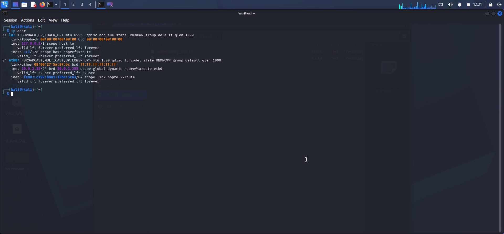
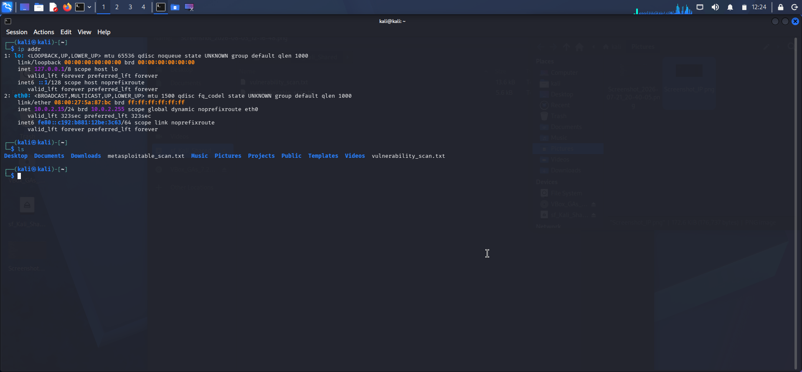
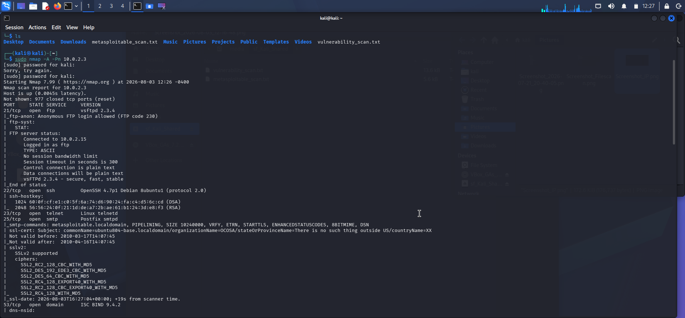
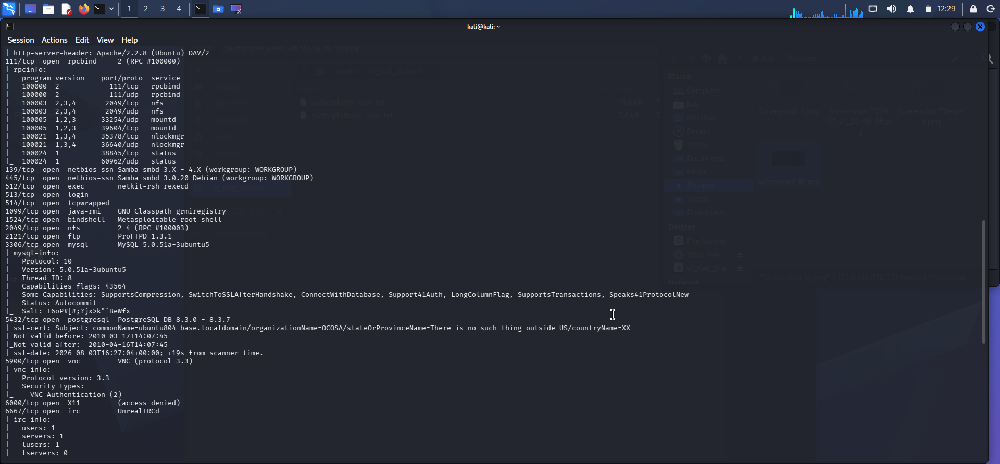
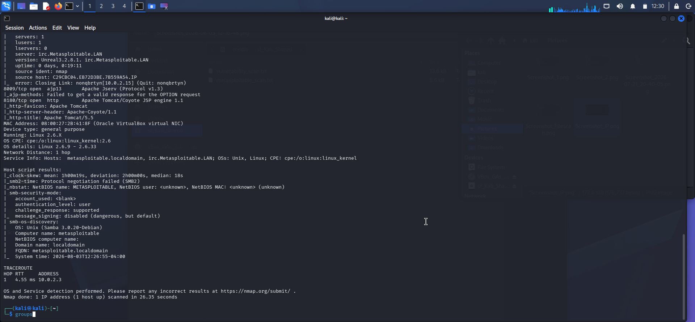
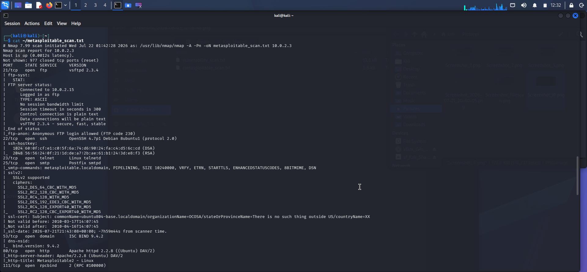
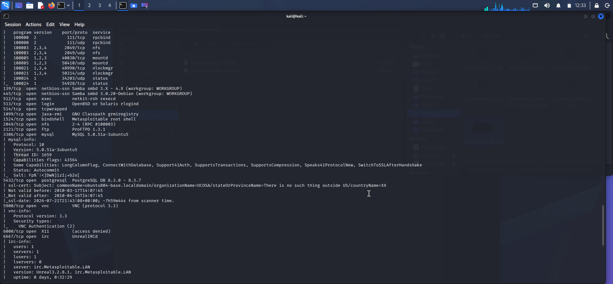
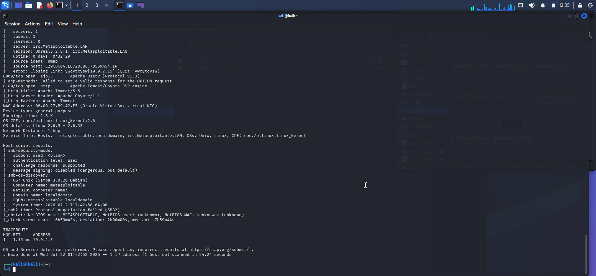

# Metasploitable 2 Vulnerability Assessment

## Project Overview

This project documents a vulnerability assessment performed against the Metasploitable 2 vulnerable virtual machine using Kali Linux. The objective was to identify exposed services, discover security weaknesses, and recommend mitigation strategies.

## Objectives

- Identify open ports and running services.
- Detect known vulnerabilities.
- Assess security risks.
- Recommend appropriate security controls.

## Lab Environment

- Kali Linux
- Metasploitable 2
- VirtualBox
- Nmap

## Tools Used

- Nmap
- Linux Terminal
- VirtualBox

## Scan Commands

nmap -A <Target-IP>
nmap --script vuln <Target-IP>
## Scan Results
## Assessment Screenshots

### Target IP Discovery

### File Scan

### Nmap Scan

### Nmap Scan Results

### Service Enumeration

### Vulnerability Detection

### Additional Findings

### Final Results

The complete scan outputs are available in the scans folder.

## Screenshots

Evidence of the assessment is available in the screenshots folder.

## Key Findings

- Multiple unnecessary services exposed.
- SMB service detected.
- FTP service running.
- Telnet service enabled.
- Several outdated services identified.

## Recommendations

- Disable unnecessary services.
- Update vulnerable software.
- Enforce strong authentication.
- Restrict network access using firewalls.
- Perform regular vulnerability assessments.

## Author

Daniel Iwuji
Cybersecurity Analyst
